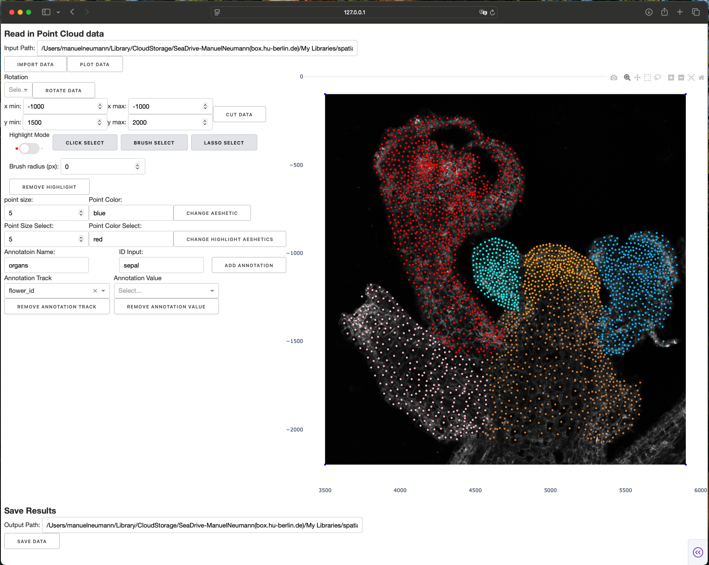

### iSTA (interactive Spatial Transcriptomics Annotation)
This Dash/python app supports the interactive annotation of Spatial Transcriptomics data for .anndata objects within python.

### User Interface



### Get the repository
Pick any folder on your computer. In a terminal, go to that folder and download the repository:

```bash
git clone https://github.com/rywet56/iSTA.git
cd iSTA
```

To update a copy you already have:

```bash
git pull
```

### Set up the environment
The app runs in a conda environment called `anno_2d`. From inside the `iSTA` folder:

```bash
conda env create -f environment.yml
conda activate anno_2d
python -m ipykernel install --user --name anno_2 --display-name "Python (anno_2d)"
```

The last line registers the environment as a Jupyter kernel, so the preprocessing notebook can use it. You only need to create the environment once. Later, activate it again with `conda activate anno_2d`.

### Start the app
From the `iSTA` folder, with `anno_2d` activated:

```bash
python iSTA.py
```

Then open [http://127.0.0.1:8051/](http://127.0.0.1:8051/) in your browser.

### Working directory
The repository folder is where the app code lives. Your data can sit somewhere else.

In the app, under **Read-write data**, set **Working directory** to the folder that holds your section `.pkl` files. The file list underneath shows the `.pkl` files in that folder and in one level of subfolders. Choose a file, press **Import Data** to load it, then **Plot Data** to draw it.
